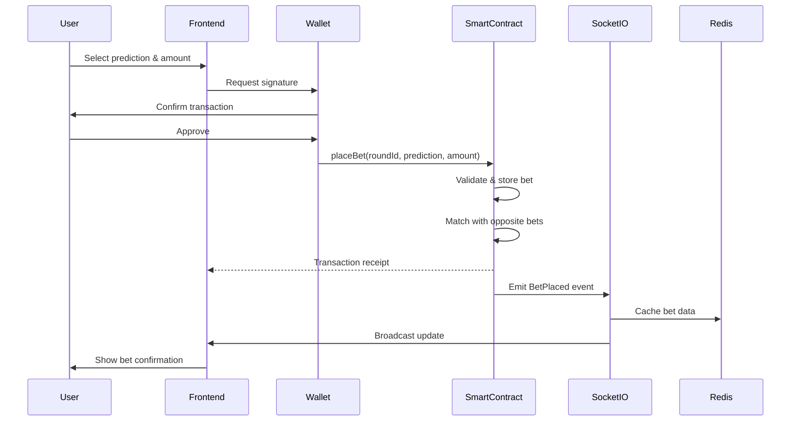
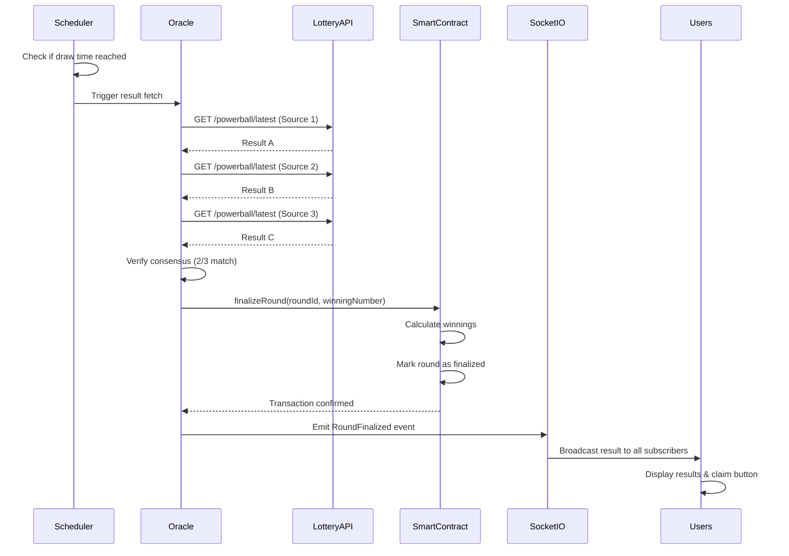
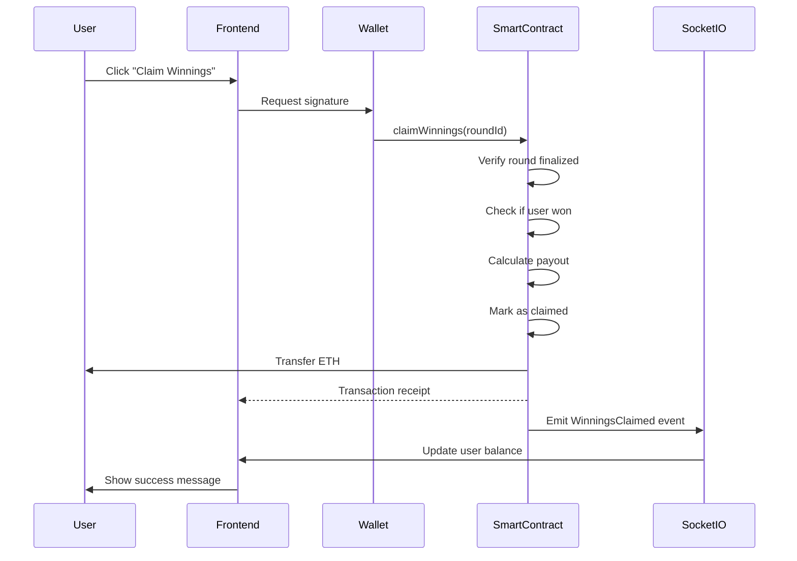

# System Architecture - P2P Lottery Platform

## Overview

This document describes the complete system architecture for the P2P Lottery Prediction Platform (LottoChain).

## Architecture Diagram

```
┌─────────────────────────────────────────────────────────────────────┐
│                           USER LAYER                                 │
├─────────────────────────────────────────────────────────────────────┤
│                                                                       │
│  ┌──────────┐      ┌──────────┐      ┌──────────┐                  │
│  │ Browser  │      │  Mobile  │      │  Wallet  │                  │
│  │   (Web)  │      │   App    │      │MetaMask/ │                  │
│  │          │      │          │      │WalletCon │                  │
│  └────┬─────┘      └────┬─────┘      └────┬─────┘                  │
│       │                 │                  │                         │
│       └─────────────────┴──────────────────┘                         │
│                         │                                            │
└─────────────────────────┼────────────────────────────────────────────┘
                          │
                          │ HTTPS/WSS
                          │
┌─────────────────────────┼────────────────────────────────────────────┐
│                    EDGE LAYER                                         │
├─────────────────────────┼────────────────────────────────────────────┤
│                         │                                            │
│                  ┌──────▼──────┐                                     │
│                  │ Cloudflare  │                                     │
│                  │   - CDN     │                                     │
│                  │   - DDoS    │                                     │
│                  │   - WAF     │                                     │
│                  │   - SSL     │                                     │
│                  └──────┬──────┘                                     │
│                         │                                            │
└─────────────────────────┼────────────────────────────────────────────┘
                          │
                 ┌────────┴────────┐
                 │                 │
┌────────────────▼────┐    ┌──────▼──────────────────────────────────┐
│  FRONTEND LAYER     │    │    BACKEND LAYER                        │
├─────────────────────┤    ├─────────────────────────────────────────┤
│                     │    │                                         │
│  ┌──────────────┐  │    │  ┌────────────────┐  ┌───────────────┐ │
│  │   Vercel     │  │    │  │ Socket.io      │  │  API Routes   │ │
│  │  Next.js 14  │  │    │  │  Server        │  │  (Vercel)     │ │
│  │  + React     │◄─┼────┼─►│  (Railway/DO)  │◄─┤               │ │
│  │  + Wagmi     │  │    │  │  Real-time     │  │  - /api/bet   │ │
│  │  + RainbowKit│  │    │  │  Updates       │  │  - /api/round │ │
│  └──────┬───────┘  │    │  └────────┬───────┘  │  - /api/claim │ │
│         │          │    │           │          └───────┬───────┘ │
│         │          │    │           │                  │         │
│    ┌────▼────┐     │    │      ┌────▼────┐       ┌────▼────┐    │
│    │  UI     │     │    │      │  Redis  │       │ Oracle  │    │
│    │Components│    │    │      │ Upstash │       │ Service │    │
│    └─────────┘     │    │      │ - Cache │       │Chainlink│    │
│                    │    │      │ - Queue │       └─────────┘    │
│                    │    │      │ - Session│                     │
└────────────────────┘    │      └─────────┘                      │
                          │                                        │
                          └────────────────────────────────────────┘
                                       │
                                       │ JSON-RPC
                                       │
┌──────────────────────────────────────▼───────────────────────────────┐
│                      BLOCKCHAIN LAYER                                 │
├───────────────────────────────────────────────────────────────────────┤
│                                                                       │
│  ┌────────────────────────────────────────────────────────┐          │
│  │              Polygon Network (MATIC)                   │          │
│  │                                                         │          │
│  │  ┌──────────────────────────────────────────────┐     │          │
│  │  │     P2PLotteryBetting Smart Contract         │     │          │
│  │  │                                               │     │          │
│  │  │  • placeBet()                                │     │          │
│  │  │  • finalizeRound()                           │     │          │
│  │  │  • claimWinnings()                           │     │          │
│  │  │  • matchBets()                               │     │          │
│  │  │                                               │     │          │
│  │  │  State:                                       │     │          │
│  │  │  - rounds[]                                   │     │          │
│  │  │  - predictionPools[]                          │     │          │
│  │  │  - userBets[]                                 │     │          │
│  │  └──────────────────────────────────────────────┘     │          │
│  │                                                         │          │
│  │  ┌──────────────────────────────────────────────┐     │          │
│  │  │         Chainlink Oracle Node                │     │          │
│  │  │  - Fetches lottery results                   │     │          │
│  │  │  - Consensus mechanism                       │     │          │
│  │  └──────────────────────────────────────────────┘     │          │
│  │                                                         │          │
│  └─────────────────────────────────────────────────────────┘          │
│                                                                       │
└───────────────────────────────────────────────────────────────────────┘
                                       │
                                       │ API Calls
                                       │
┌──────────────────────────────────────▼───────────────────────────────┐
│                    EXTERNAL DATA LAYER                                │
├───────────────────────────────────────────────────────────────────────┤
│                                                                       │
│  ┌──────────────┐  ┌──────────────┐  ┌──────────────┐              │
│  │ Lottery API  │  │ Lottery API  │  │ Lottery API  │              │
│  │  Source 1    │  │  Source 2    │  │  Source 3    │              │
│  │ (Primary)    │  │ (Secondary)  │  │ (Tertiary)   │              │
│  └──────────────┘  └──────────────┘  └──────────────┘              │
│                                                                       │
│  • US Powerball API                                                  │
│  • Mega Millions API                                                 │
│  • Multiple sources for consensus                                    │
│                                                                       │
└───────────────────────────────────────────────────────────────────────┘
```

## Data Flow Diagrams

### 1. Betting Flow



### 2. Round Finalization Flow



### 3. Claiming Winnings Flow



## Component Details

### Frontend Layer

**Technology**: Next.js 14 (App Router) + TypeScript + Tailwind CSS

**Components**:
- `BettingInterface.tsx` - Main betting UI
- `WalletConnect.tsx` - Wallet connection
- `BetStatus.tsx` - Real-time bet status
- `RoundHistory.tsx` - Historical rounds
- `LiveStats.tsx` - Live statistics dashboard
- `ClaimButton.tsx` - Claim winnings/refunds

**Hooks**:
- `useContract.ts` - Smart contract interactions
- `useWallet.ts` - Wallet management
- `useSocket.ts` - WebSocket connection
- `useRound.ts` - Round data management

**Features**:
- Server-side rendering for SEO
- Real-time updates via Socket.io
- Responsive design (mobile-first)
- Progressive Web App (PWA)

### Backend Layer

**Technology**: Node.js + Express + Socket.io

**Services**:
1. **Socket.io Server** (Railway/Digital Ocean)
   - Real-time bet updates
   - Round status broadcasts
   - User notifications

2. **API Routes** (Vercel Serverless)
   - `/api/bet` - Validate and cache bets
   - `/api/round` - Get round information
   - `/api/claim` - Process claims
   - `/api/stats` - Platform statistics

3. **Oracle Service**
   - Fetch lottery results
   - Verify consensus
   - Submit to blockchain

4. **Scheduler Service**
   - Auto-lock rounds
   - Trigger result fetching
   - Process refunds

**Redis (Upstash)**:
- Caching layer
- Session management
- Rate limiting
- Real-time data storage

### Blockchain Layer

**Network**: Polygon (MATIC)
- Mainnet: Production
- Mumbai: Testing

**Smart Contract**: `P2PLotteryBetting.sol`

**Key Functions**:
```solidity
// User functions
placeBet(roundId, prediction) payable
claimWinnings(roundId)

// Operator functions
createRound(drawTime)
lockRound(roundId)

// Oracle functions
finalizeRound(roundId, winningNumber)

// View functions
getRoundInfo(roundId)
getPredictionPool(roundId, prediction)
getUserBet(roundId, user)
```

**Events**:
- `BetPlaced(roundId, user, prediction, amount)`
- `BetMatched(roundId, user, matchedAmount)`
- `RoundLocked(roundId, timestamp)`
- `RoundFinalized(roundId, winningNumber, timestamp)`
- `WinningsClaimed(roundId, user, amount)`
- `RefundIssued(roundId, user, amount)`

### Edge Layer

**Cloudflare**:
- CDN (Content Delivery Network)
- DDoS protection
- WAF (Web Application Firewall)
- SSL/TLS termination
- Rate limiting (edge level)
- Bot protection

## Security Architecture

### Defense in Depth

```
┌─────────────────────────────────────────┐
│  Layer 1: Edge Protection (Cloudflare)  │
│  - DDoS mitigation                      │
│  - Bot detection                        │
│  - Rate limiting                        │
└─────────────────┬───────────────────────┘
                  │
┌─────────────────▼───────────────────────┐
│  Layer 2: Application Security          │
│  - Input validation                     │
│  - CORS policies                        │
│  - Authentication                       │
└─────────────────┬───────────────────────┘
                  │
┌─────────────────▼───────────────────────┐
│  Layer 3: Smart Contract Security       │
│  - Reentrancy guards                    │
│  - Access control                       │
│  - Input validation                     │
└─────────────────┬───────────────────────┘
                  │
┌─────────────────▼───────────────────────┐
│  Layer 4: Data Security                 │
│  - Encryption at rest                   │
│  - Encryption in transit                │
│  - Secure key management                │
└─────────────────────────────────────────┘
```

### Security Features

1. **Smart Contract**:
   - OpenZeppelin security libraries
   - Reentrancy protection
   - Pausable in emergency
   - Role-based access control
   - Multi-signature for critical operations

2. **Backend**:
   - Rate limiting (Redis)
   - Input validation (Zod)
   - Signature verification
   - Encrypted data storage
   - Audit logging

3. **Frontend**:
   - XSS protection
   - CSRF tokens
   - Secure wallet connection
   - Input sanitization

## Scalability

### Horizontal Scaling

```
Frontend (Vercel):
┌──────┐  ┌──────┐  ┌──────┐
│ Edge │  │ Edge │  │ Edge │  ... (Auto-scaling)
└──────┘  └──────┘  └──────┘

Backend (Railway):
┌──────┐  ┌──────┐  ┌──────┐
│ API  │  │ API  │  │ API  │  ... (Manual scaling)
└──────┘  └──────┘  └──────┘

Socket.io (Digital Ocean):
┌──────┐  ┌──────┐
│ WS1  │  │ WS2  │  ... (Redis adapter for multi-instance)
└──────┘  └──────┘
```

### Performance Optimization

1. **Caching Strategy**:
   - Round data: 15 minutes
   - Pool data: 10 seconds
   - User bets: 1 minute
   - Static assets: 24 hours

2. **Database Strategy**:
   - Hot data: Redis (fast access)
   - Cold data: PostgreSQL/MongoDB (historical)
   - Blockchain: Canonical source

3. **CDN Strategy**:
   - Static assets on Cloudflare CDN
   - API responses cached at edge when possible
   - WebSocket connections load-balanced

## Monitoring & Observability

```
┌─────────────────────────────────────────────┐
│           Monitoring Stack                   │
├─────────────────────────────────────────────┤
│                                             │
│  Frontend:                                  │
│  - Vercel Analytics                         │
│  - Web Vitals                               │
│  - Error tracking (Sentry)                  │
│                                             │
│  Backend:                                   │
│  - Uptime monitoring                        │
│  - API response times                       │
│  - Error rates                              │
│                                             │
│  Blockchain:                                │
│  - Transaction monitoring                   │
│  - Gas price tracking                       │
│  - Event logs                               │
│                                             │
│  Infrastructure:                            │
│  - Server metrics (CPU, RAM, Disk)          │
│  - Network metrics                          │
│  - Redis metrics                            │
│                                             │
└─────────────────────────────────────────────┘
```

## Deployment Architecture

### Development Environment
```
Local Machine
├── Smart Contract (Hardhat + Mumbai Testnet)
├── Frontend (Next.js Dev Server)
└── Backend (Local Node.js + Local Redis)
```

### Staging Environment
```
Cloud Infrastructure
├── Smart Contract (Mumbai Testnet)
├── Frontend (Vercel Preview)
└── Backend (Railway Staging + Upstash Staging)
```

### Production Environment
```
Cloud Infrastructure
├── Smart Contract (Polygon Mainnet)
├── Frontend (Vercel Production + Cloudflare)
└── Backend (Railway Production + Upstash Production)
```

## Cost Estimation

### Monthly Costs (Small Scale - <10K users)

| Service | Tier | Cost |
|---------|------|------|
| Vercel | Pro | $20/mo |
| Railway | Pro | $20/mo |
| Digital Ocean | Basic Droplet | $6/mo |
| Upstash Redis | Free/Pro | $0-10/mo |
| Cloudflare | Pro | $20/mo |
| Domain | .com | $12/yr |
| **Total** | | **~$76/mo** |

### Gas Costs (Polygon)

| Operation | Gas | Cost (@30 Gwei, MATIC=$0.80) |
|-----------|-----|------------------------------|
| Place Bet | ~100K | $0.0024 |
| Finalize Round | ~150K | $0.0036 |
| Claim Winnings | ~80K | $0.0019 |

**Note**: Polygon is very cheap compared to Ethereum mainnet (100-1000x cheaper)

## Future Enhancements

1. **Layer 2 Migration**: Move to Arbitrum or Optimism for even lower fees
2. **Multi-chain**: Support multiple blockchains
3. **Mobile App**: Native iOS/Android apps
4. **Advanced Predictions**: More prediction types and combinations
5. **Social Features**: Chat, leaderboards, achievements
6. **DAO Governance**: Community-driven platform decisions
7. **Token Economics**: Platform token for rewards and governance

---

This architecture is designed for:
- ✅ High availability (99.9% uptime)
- ✅ Low latency (<100ms API response)
- ✅ Scalability (10K+ concurrent users)
- ✅ Security (Defense in depth)
- ✅ Cost-effectiveness (~$76/mo starting)
- ✅ Easy maintenance and updates
